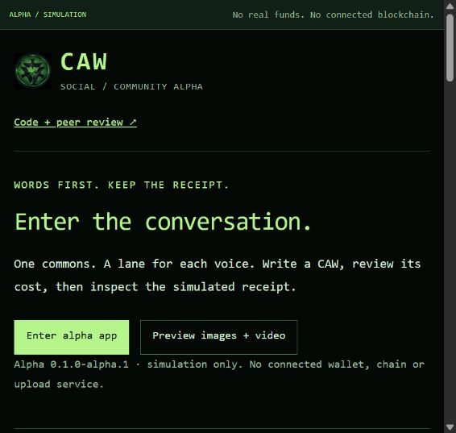

# CAW Social - alpha

Words first. Keep the receipt.

A community implementation guided by the CAW manifesto and recovered R2. The website is the entrance; Commons is the conversation app. This is work for public review, not an official CAW release.

**The frontend is a simulation. The protocol is a local experiment. Production remains blocked.** No real wallet, funds, private messages or public media uploads are connected.

**Initial review target: alpha.20, [`91479b6dc8c9a264411d75177d43029e0266c354`](https://github.com/Xubu-Trad/caw-social-alpha/commit/91479b6dc8c9a264411d75177d43029e0266c354).** Review this fixed commit, even as documentation on `main` develops. [Reproduce the baseline](docs/REVIEW_BASELINE.md), choose a [review issue](https://github.com/Xubu-Trad/caw-social-alpha/issues), or follow the [current gates](docs/ROADMAP.md).

The latest protocol experiment settled **nine signed posts** using historical CAW token logic and fixed test NFT accounts. It joins current ownership, exact signed text, a 5,000 CAW fee, allocation and recorded history. Read [one signed, paid CAW](docs/PAID_ACTION.md) for the evidence and limits.



## Try the frontend

Use Node.js **24.20.0**. The frontend and Node offline tests have no third-party package dependencies or install step. Review the source, then run:

```sh
npm test
npm run build
npm start
```

Open **http://127.0.0.1:4173/website.html** for the entrance or **http://127.0.0.1:4173/** for Commons. Stop with Ctrl+C. The server binds only to loopback. Optional Python/EVM experiments have separate requirements; see the [review guide](docs/REVIEW_GUIDE.md).

Write a draft, inspect the proposed cost, confirm a simulated post, then read its receipt. Switch accounts, preview local media or compare exported records. Nothing is sent while typing; refreshing resets the demonstration. Media preview does not upload or settle an attachment.

## What the evidence establishes

| Area | Current boundary |
| --- | --- |
| Frontend | Local conversation lanes, cost review, receipts, account switching and bounded media preview |
| Experimental protocol | Fixed test NFT ownership, actual token logic on a local fork, signed paid posts and exact allocation |
| Reconstruction | Separate JavaScript and Python implementations check the retained chain interval; provider and manifest trust remain |
| Registration | Blocked by the existing token's rejection of the literal zero-address transfer |
| Production | Unfinished; no public deployment, permanence guarantee or authenticated production authority graph |
| Review | Public code and evidence; external audit and community acceptance are not established |

**Validation:** 366/366 offline tests across 25 files; 22 build assets. Two independently written readers produced identical complete reconstructions after the local node stopped. These are finite tests, not an outside audit or a permanence guarantee.

## Read, reproduce, challenge

| Start here | Purpose |
| --- | --- |
| [Paid-action experiment](docs/PAID_ACTION.md) | Follow one complete experimental action and reconstruct its records |
| [C-001 decision request](docs/C001_DECISION_REQUEST.md) | Inspect the registration conflict and the evidence needed for a decision |
| [Assessment response](docs/CONCERNS_ALPHA19_REVIEW.md) | Separate verified concerns, corrections and next work |
| [Review guide](docs/REVIEW_GUIDE.md) | Run the frontend/tests and find earlier experiments |
| [Manifesto + R2 alignment](docs/MANIFESTO_R2_ALIGNMENT_REVIEW.md) | Trace all 59 mapped primary requirements |
| [15 open conflicts](sources/SPEC_CONFLICTS.md) | Review unresolved protocol decisions |
| [Protocol scope](docs/PROTOCOL_V0_SCOPE.md) | Inspect acceptance gates and unfinished adversarial/recovery work |
| [Validation](docs/VALIDATION.md) | Current results and historical browser limits |
| [Source coverage](docs/SOURCE_COVERAGE.md) | What was examined, preserved and excluded |

R2 calls for public contribution and review before an agreed release, without developer backdoors, proxies or multisigs. These requirements remain gates, not claims earned by a passing test suite. Upstream submissions target the relevant **cawdevelopment** repository only. The implementation and experiments are original; preserved [token reference source](experiments/token-source/NOTICES.md) retains separate attribution.

[Contributing](CONTRIBUTING.md) - [Security](SECURITY.md) - [Licensing](LICENSE_STATUS.md)
