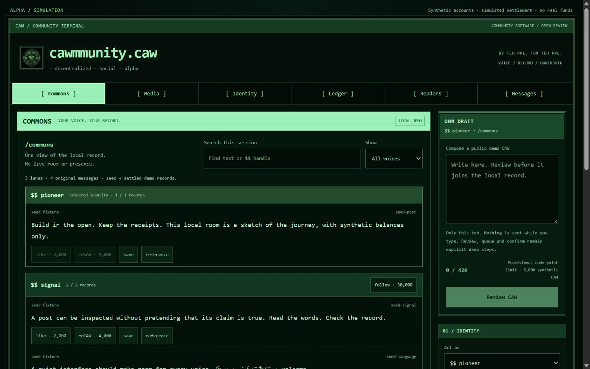
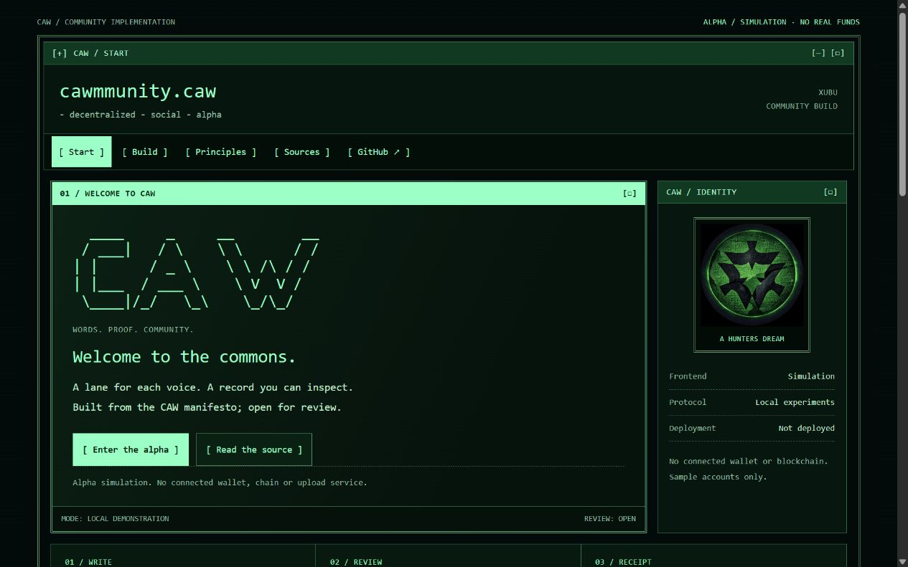

# cawmmunity.caw - decentralized - social

i have started building a public implementation of the caw manifesto.

this is early community work. i am sharing it now because decentralization has to shape how we build, while assumptions can still be challenged and designs can still be replaced.

i am asking the cawmmunity to build this with me. developers, reviewers, security researchers, wallet builders, indexer builders, frontend contributors and people who disagree with me. your input should help decide what this becomes. the goal is for the work to stand without xubu at its center.

the recovered R2 points toward public contribution, peer review and agreement before release. that is the process this repository is trying to follow.

the test we still need to pass is simple: xubu leaves and this website disappears. others can run compatible clients, recover the same public record, submit signed caws and withdraw their funds without my approval. **that is a design goal, not a capability established by this alpha.**

bring code. bring criticism. bring failed reproductions. bring the thing i missed. start with an [open review issue](https://github.com/Xubu-Trad/cawmmunity.caw-decentralized-social/issues) or the [contribution guide](CONTRIBUTING.md).

by teh ppl. for teh ppl.



Authentic screenshot of the local alpha. Synthetic accounts; no real funds. [Image provenance](docs/images/README.md).

<details>
<summary>Website entrance</summary>



</details>

**The frontend is a simulation. The protocol is a local experiment. Production remains blocked.** No real wallet, private messages or public media uploads are connected. This is not an official CAW release.

Two components, one repository:

- **Frontend:** [cawmmunity.caw - decentralized - social - alpha](docs/FRONTEND_POLICY.md) — the website and Commons conversation view.
- **Protocol:** [cawmmunity.caw - decentralized - social - protocol](docs/PROTOCOL_V0_SCOPE.md) — contracts, readers and local experiments.

These are project names. `.caw` does not establish domain registration, deployment or production readiness.

## Try it locally

Use Node.js **24.20.0**. The frontend and Node offline tests need no third-party packages or install step. Review the source, then run:

```sh
npm test
npm run build
npm start
```

Open **http://127.0.0.1:4173/website.html** for the website or **http://127.0.0.1:4173/** for Commons. The server binds only to loopback; stop with Ctrl+C. Optional Python/EVM experiments have separate requirements in the [review guide](docs/REVIEW_GUIDE.md).

Draft, review a simulated fee, post, and inspect the receipt. Nothing is sent while typing. Reloading resets the demonstration; selected media stays a local preview.

## Evidence, with limits

| Record | What ran | Boundary |
| --- | --- | --- |
| [Alpha.20: paid action](docs/PAID_ACTION.md) | Nine signed posts using historical CAW token logic, fixed test NFT accounts and exact fee allocation | Local fork; no production registration |
| [Alpha.21: adversarial regression](docs/PAID_ACTION_REGRESSION.md) | 72 cases against the unchanged paid-action contract | Separate synthetic token and chain; broader review remains open |
| [Alpha.22: history acquisition](docs/PAID_HISTORY_ACQUISITION.md) | Two live collectors and two offline readers agree on a fresh 20-transaction history | Shared node and manifest trust; independent providers, chain authentication and reorg recovery remain open |
| [Alpha.28: branch recovery](docs/PAID_REORG_RECOVERY.md) | Two five-block branches acquired twice; replacement and restart recover exact selected messages and accounting | Controlled local rollback; provider agreement, authenticated history and public finality remain open |

**Recorded validation:** 446/446 offline tests across 29 files; 22 build assets. See [results and browser coverage](docs/VALIDATION.md). These finite checks establish neither an external audit, community agreement nor permanent availability.

## Read, reproduce, challenge

**Initial review target: alpha.20, [`91479b6dc8c9a264411d75177d43029e0266c354`](https://github.com/Xubu-Trad/cawmmunity.caw-decentralized-social/commit/91479b6dc8c9a264411d75177d43029e0266c354).** The [pinned baseline](docs/REVIEW_BASELINE.md) stays fixed as later work develops.

Follow the [current gates](docs/ROADMAP.md), reproduce a result with the [review guide](docs/REVIEW_GUIDE.md), or choose a [review issue](https://github.com/Xubu-Trad/cawmmunity.caw-decentralized-social/issues).

Trace the [59 mapped requirements](docs/MANIFESTO_R2_ALIGNMENT_REVIEW.md), [15 open conflicts](sources/SPEC_CONFLICTS.md) and [source coverage](docs/SOURCE_COVERAGE.md). Username registration remains blocked by the existing token's rejection of the literal zero-address transfer; [C-001](docs/C001_DECISION_REQUEST.md) preserves the evidence and decision request. A production authority graph and durable public recovery are unfinished.

R2 calls for public contribution, peer review and an agreed release, without developer backdoors, proxies or multisigs. These remain release gates. Upstream contributions target the relevant **cawdevelopment** repository only.

Original code and project-authored explanatory documentation use the [scoped MIT license](LICENSE_STATUS.md). Artwork, screenshots, primary texts and raw observations are excluded; preserved [third-party notices](experiments/token-source/NOTICES.md) retain their separate attribution.

[Contributing](CONTRIBUTING.md) · [Security](SECURITY.md) · [Licensing](LICENSE_STATUS.md)
