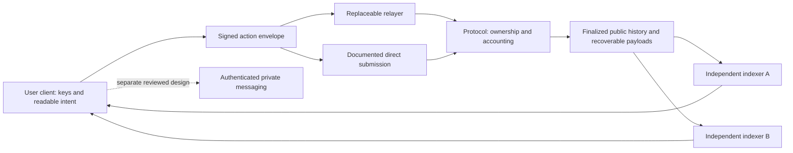

> Alpha.10 revision: [Retained checkpoint comparison](CHECKPOINT_CONTINUITY.md) verifies exact ordered history under original trust. Only an identical record or verified extension can advance the anchor; older or conflicting histories preserve it. Spending and cancellation remain visible. No live grant is restored, and no global freshness or durable retention is established. All source conflicts remain open; earlier reviews below are historical.

> Signed recovery revision: [The copied ledger now preserves and verifies a bounded signed-action record](SIGNED_RECORD_RECOVERY.md). Inherited history and fixture transfers remain explicitly unsigned; test bindings and recorded time are not ownership or historical-time proof. Earlier reviews below are historical. [Current validation](VALIDATION.md) controls execution claims.

> Signed settlement revision: [Identity verifies and applies CAWs in an isolated copied ledger](SIGNED_SETTLEMENT.md). Commons remains unsigned and synthetic. This does not authenticate NFT ownership or preserve signed archival history. Earlier reviews below are historical; [current validation](VALIDATION.md) controls test claims. All production conflicts remain unchanged.

> Signature revision: [Identity now offers a local signature lab](SIGNATURE_LAB.md). It verifies a bounded synthetic action against a separate test-key binding; Commons settlement is still unsigned and synthetic. Earlier reviews below are historical. See [current validation](VALIDATION.md). No production conflict is resolved by this experiment.

> Economics revision: [Ledger comparison and shared allocation arithmetic](ECONOMIC_SCENARIOS.md) make competing interpretations testable. Active actions remain on the same provisional appendix profile. The earlier review below is historical; see [current validation](VALIDATION.md) and source hashes for this revision. No source conflict is resolved by displaying alternatives.

# Architecture proposal

Status: local fixture architecture implemented and exercised by the 40-test B-001 suite. Bounded browser review subsequently became available and exercised the core synthetic journeys; current rerun limits and artifact-specific results are recorded in BOOTSTRAP.md (supporting local record omitted; see the source-coverage note). Production architecture is still proposed; no production stack has been accepted.

## Smallest useful build

Use a responsive browser interface with plain HTML, CSS and JavaScript modules. A small Node HTTP server serves an explicit public-file allowlist on loopback. The browser runs a deterministic, synthetic account/action model; Node's built-in test runner checks the same model plus a separately written reference calculation. No package-registry dependencies, database, wallet connector, chain node, encryption library or managed service are needed for this phase.

The purpose is to test a connected journey and make conflicts visible. The model must not pretend that a simulated username is an NFT, an action ID is a signature, or an in-memory receipt is blockchain finality. Switching two fixture operators demonstrates portable data handling only. It is not the production builder-disappears test.

The requested expansion includes an associated explanatory website, portable static distribution and local image/video previews. The [resilience plan](RESILIENCE_PLAN.md) separates local copy demonstrations from future independent hosting, naming, media retention and protocol recovery tests. No production provider is selected; PWA/native installation and persistent media publication remain proposed scope, not completed capabilities.

## Production candidates compared

| Candidate | Useful properties | Unresolved requirements / dependencies | Initial decision |
|---|---|---|---|
| Single Ethereum settlement layer; immutable identity/accounting/action contracts; complete public event payloads; replaceable indexers/relays | Avoids bridging the existing asset; public custody rules and reconstructable action history are plausible | Original-token burn compatibility; high execution/storage costs; archival availability; who funds mostly gasless relays; privacy/DM scope | Preferred candidate to investigate after fixtures, not production selection |
| Settlement on Ethereum, content in separately operated storage with commitments | Potentially reduces chain payload cost | A commitment proves integrity only; retention, retrieval incentives, payer, unavailable content, and independent reconstruction must be resolved | Do not adopt merely because a CID exists |
| L2 or multi-chain application and bridged balances | Potentially cheaper interaction execution | Bridge custody, sequencer/censorship/upgrade authorities, message ordering, peer wiring, data expiry and exits enlarge the trust graph | Deferred unless measured requirements justify it |
| Nostr/Matrix service as the authoritative social system | Existing social transport and client ecosystems | Does not by itself implement NFT-controlled CAW balances, canonical settlement, source reward rules or permanent public history | Not the baseline authority; transport evaluation would be separate |

These are design inferences, not a claim that Ethereum or any named network guarantees permanence, cheap interaction, privacy or absence of control. No candidate has yet demonstrated every requirement.

## Intended boundaries after the prototype

The protocol validates current NFT authority, chain/contract domain, action kind, payload commitment, economic recipient/amount, nonce and expiry under a resolved specification. A relayer submits the unchanged request and cannot rewrite economically meaningful fields. Frontend moderation affects that frontend's presentation or service, not underlying account custody. A direct transaction costs gas; it must not be advertised as equivalent in cost to ordinary relayed use.

Public state is reconstructed from a specified finalized history with a deterministic serializer and ordering rule. Indexer databases are caches, never the only account ledger. Media hosting remains a frontend responsibility, with explicit retention and recovery limits. Private-message payloads and history require a separate decision before implementation.

## Dependency and control register

| Dependency | Controller / possible refusal or change | Cost and availability | Replacement / failure assumption |
|---|---|---|---|
| Browser | Vendor updates, extensions and device owner | User device resources; endpoint compromise remains possible | Compatible browser; semantic HTML and portable source; no extension or hosted font required for demo |
| Node runtime (local only) | Upstream runtime and bundled dependencies | Local disk/memory; pinned executable hash | Rebuild with verified documented runtime; no system install; runtime pin is not an audit |
| Existing CAW token | Actual deployed contract and any real authority paths, still to verify | Existing asset semantics; no substitute presented as CAW | Cannot silently replace the asset; incompatibility is a specification gate |
| Settlement network (candidate) | Network consensus, clients, protocol upgrades and access providers | Execution, historical data access and internet availability | Independent node/RPC paths; specify archival requirements; never claim no infrastructure reliance |
| Proposed immutable contracts | Published code/configuration; any constructor or external dependency can still be wrong | Deployment and per-action gas | Verify complete authority/wiring graph before deployment; no secret upgrade key as a repair plan |
| Relayer | Each operator can refuse service and stop sponsorship | Gas, bandwidth and maintenance | Multiple operators plus direct submission; funding without source-conflicting fees remains OPEN |
| Indexer/API | Each operator can omit or lie in responses | Storage, RPC and hosting | Reconstruct from canonical public data; verify receipts and compare independent exports |
| Public history storage | Selected protocol and retention operators, undecided | Replication, retrieval and indefinite retention are not free | Full-data recovery and cost model required; hashes alone fail availability acceptance |
| Frontend/domain | Its operator, hosting and domain providers | Optional hosting/domain expense | Local or alternate frontend; source and reproducible build cannot depend on Xubu's credentials |
| DM transport and crypto | Undecided | Relay/radio/network metadata and key-recovery constraints | No adoption until transfer semantics, reviewed protocol/library and endpoint threat model are resolved |

## Current gates

Original CAW compatibility, reward/stake semantics, message length, NFT transfer and pending actions, permanent-data scope, mostly gasless operation funding, DM history access and system-wide authority remain unresolved. See the source conflict register C-001 through C-015. The first prototype exposes these questions; it does not resolve them through UI defaults.

Reuse no upstream application or BitChat code before file-level licensing and relevant implementation review. In particular, a README's public-domain label is insufficient when the repository license contradicts it. The initial interface is original.
