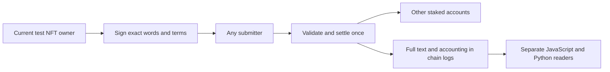

# One signed, paid CAW

The local experiment now connects account ownership, signed words, a 5,000-CAW fee in a local fork using historical token logic, distribution and recorded history. **This is an experimental protocol slice. The website remains a simulation, and production registration is blocked.**



## What ran

The original [paid-action contract](../experiments/paid-action/CawPaidActionProbe.sol) compiled with Solidity 0.8.10, optimizer 200 and London rules. Pinned Anvil 1.8.1 executed 56 local transactions: two funding transfers and a 54-transaction history. Nine posts settled; 22 deliberately invalid transactions reverted. The run made 1,416 local requests and 40 forwarded historical reads. The owned node stopped after 62.406 seconds, with a measured peak of 40,976,384 bytes.

CAW code and storage came from Ethereum block 25,936,362. They were not patched. Local funding used an impersonated public address ending `dead`, and native gas balances were fabricated. This is local test authority: it cannot spend that address's public-chain tokens or establish access to inaccessible funds. Disposable, publicly specified test signing scalars use test addresses whose historical code was checked empty. No real wallet, public transaction or deployment was used.

Each accepted post debits **5,000 CAW**, or `5000000000000000000000` base units. The fee is immutable in this contract. Accounts 2 and 3 lock one and two deposited base units, respectively. Their allocation ratio is 1:2; these deliberately tiny stakes exercise exact rounding. The payer is excluded by account ID, including while it has a stake. Another ID controlled by the same wallet can still receive a share: owner-wide exclusion is not implemented or agreed.

After nine posts and a one-base-unit withdrawal, the vault holds `125000000000000000000019` base units: `125000000000000000000010` in account credits plus nine in unavailable pool dust. Stake is a locked subset of credit. Holding the account permits custody without staking. No builder or relayer receives a protocol share; local submitters pay gas. Sustainable relay funding remains unresolved.

## Exact authority and words

The [EIP-712](https://eips.ethereum.org/EIPS/eip-712) signature commits chain ID, contract, profile, account ID, ownership epoch, nonce, time window, current three-account stake commitment, exact text hash and fee. A nonce is consumed only by a successful post. It persists through NFT transfers. The captured run rejects duplicate submission by another submitter, altered text, wrong chain/contract/fee/profile/owner, high-S signatures, expiry and changed stakes. Transfer-away and transfer-return reject the old epoch; the new owner can sign successfully.

This profile accepts 1-420 Unicode scalar values and at most 1,680 bytes of strict UTF-8. It preserves the original bytes, with no normalization, trimming or case conversion. The run accepts 419 accented scalars and 420 four-byte scalars, rejects 421 scalars, overlong encoding, surrogates and empty text, and preserves composed and decomposed text as different byte strings. Scalar counting is a proposed rule, not an agreed meaning of every source occurrence of "characters."

Code-bearing owners use the bounded [ERC-1271](https://eips.ethereum.org/EIPS/eip-1271) branch. A test contract validates the signature of its immutable test signer. Valid and trailing-data responses pass; wrong magic, revert and four-byte short responses reject. This does not establish compatibility with every wallet. The 100,000-gas verification allowance and 4,096-byte contract-signature cap are explicit experimental limits.

## Reconstruct and challenge

The [history](../experiments/paid-action/history.json) includes every captured block and transaction in the declared interval, registry creation/ownership events, full post bytes and settlement events. The [separate manifest](../experiments/paid-action/manifest.json) supplies addresses, runtime fingerprints and boundary hashes. JavaScript and Python readers start empty, import no application/writer accounting helpers, reconstruct ownership, epochs, credit, stake, nonce, messages, allocations and dust, and compare endpoint observations.

Both readers were run after the node and its listeners had stopped. They produced identical complete reconstructions: all nine messages and the final state above. The [reader execution record](../evidence/PAID_READER_EXECUTION.json) preserves the source hashes and bounded run outcomes. The [offline tests](../tests/caw-paid-action.test.mjs) also reject altered, missing and inconsistent history.

These are two independent implementations reading **one provider-derived capture**. Both still trust the supplied manifest and initial zero balance of the fresh probe. They do not authenticate block headers, transaction/receipt tries, consensus, finality, current authority or signatures afresh. Actual signature checks are established by the local contract execution. No claim of permanent archive availability or independent provider agreement follows.

```sh
python reference/paid_action_reader.py --history experiments/paid-action/history.json --manifest experiments/paid-action/manifest.json
node --input-type=module -e "import fs from 'node:fs'; import {reconstruct} from './reference/paid-action-reader.mjs'; const read=n=>JSON.parse(fs.readFileSync('experiments/paid-action/'+n+'.json','utf8')); console.log(JSON.stringify(reconstruct(read('history'),read('manifest'))));"
```

The offline Python reader uses the standard library and the retained Keccak primitive; the Node reader uses Node built-ins and the separate retained Keccak implementation. No frontend, live node, relay, indexer or original cache is required for these commands. Retained reader outputs are historical evidence; rerun the commands to check them.

Optional local EVM reproduction is separate from `npm test`: review `run_paid_action.py`, `paid_node.py`, `experiment-inputs.json` and `compile-standard.json` first. It requires Windows, the hash-pinned Anvil binary from the [official v1.8.1 release](https://github.com/foundry-rs/foundry/releases/tag/v1.8.1), Python with the recorded `cryptography` version, available historical-provider access and a fresh output filename. The runner requires the manifest's SHA-256 explicitly. Its four-million-gas transaction ceiling accommodates the 7,417-byte probe runtime. Startup limits remain 768 MiB free memory and 2 GiB disk; the node has a hard 512 MiB cap and 600-second deadline. The binary is not included. Provider availability and future capture bytes are not guaranteed.

## What the failed attempts taught us

The first compiler attempt exceeded Solidity's stack limit; a lexical scope change fixed it without changing the API or operation order. Two execution attempts then rejected a familiar public test-key address: its recorded code is an [EIP-7702](https://eips.ethereum.org/EIPS/eip-7702) delegation indicator. The [failure evidence](../experiments/paid-action/known-account-failure.json) retains matching signed/contract digests, the code observation and rejection. London execution is not a replay of modern delegated-account behavior. No code was cleared and no permissive signature fallback was added. Delegated-account compatibility remains open.

A later run rejected a test string altered by text transport into 838 scalars. ASCII source escapes restored the intended 419 scalars; the contract's rejection was correct. Failed captures remain retained separately and are not counted as completed runs.

## Still open

All 59 requirements and 15 source conflicts retain their status. The fixed three-ID registry is test instrumentation, not username registration. Read the [C-001 decision request](C001_DECISION_REQUEST.md): no alternate burn destination has been adopted. Fee recommendations, stake eligibility, payer exclusion, dust policy, character counting and signing windows are proposed profile choices. Fixed iteration over three accounts does not scale to an open network.

The integrated contract has no admin, proxy, arbitrary-call, rescue or dust-withdrawal entry. That finite source observation is not an authenticated production authority graph or audit. Full adversarial token/callback regression against this new combined contract, delegated-account execution under current rules, signature cancellation, reorg recovery, independent archive acquisition, authenticated full history, production registration, DM key transfer and durable public data remain unfinished. Earlier custody adversarial tests do not automatically certify this new contract. No additional UI features or wallet connection are part of this release.

The [assessment review](CONCERNS_ALPHA19_REVIEW.md) records which attached concerns were verified. Same-team review is not outside peer review or community acceptance.
