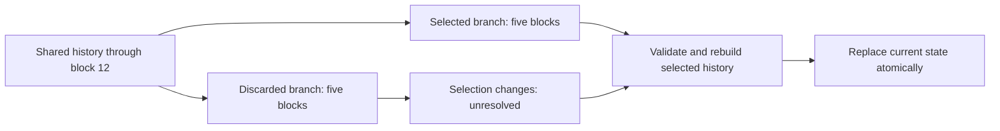

# When the selected history changes

Alpha.28 adds a bounded recovery reader and a controlled local branch experiment. When the caller selects a replacement endpoint, the reader immediately marks the old state unresolved. It rebuilds the complete selected history before publishing the replacement. A delayed result from the discarded branch cannot overwrite it.

This is experimental protocol code. The frontend remains the alpha.27 simulation. The test uses one synthetic local node; it does not establish public-chain finality, independent-provider agreement or authenticated Ethereum history.

## What ran

The unchanged paid-action contract and fixed three-account registry ran on a fresh synthetic chain 31337. Two funding transactions preceded the exclusive checkpoint at block 2. A ten-block common interval ended at block 12; each branch then added exactly five blocks, ending at height 17 with different hashes.



The controller recorded one snapshot, acquired the left branch through both unchanged collectors, retired those read leases, restored the snapshot and verified the entire ancestor header and account state. A fresh writer then created the right branch. The controller explicitly selected its endpoint. Equal height is a test condition, not a rule for choosing a canonical branch.

| Observation | Recorded result |
| --- | --- |
| Submitted local transactions | 22: two funding, ten shared, five left, five right |
| Complete acquired interval | 15 transactions per branch; the common ten appear in both datasets |
| Number / parent-hash collector requests | 57 / 84 on each branch |
| Total local / remote requests | 641 / 0 |
| Owned node duration / observed peak memory | 22.609 seconds / 23,552,000 bytes |
| Cleanup | Node stopped; its loopback listener was confirmed released |
| Source attribution | Input hashes checked before and after execution; collectors loaded from those exact bytes |

The [execution summary](../experiments/paid-reorg/execution-summary.json), [full RPC capture](../experiments/paid-reorg/execution-trace.json) and [input pins](../experiments/paid-reorg/experiment-inputs.json) preserve these observations. All actors and signing scalars are disposable test fixtures. Synthetic token installation and native gas funding are recorded; no public transaction, real wallet or historical-token execution occurred.

## The state that must change

Let `F = 5000000000000000000000` base units, `q1 = floor(F/3)` and `q2 = floor(2F/3)`. A and B are the public test actors defined in the runner. Account 1 posts; accounts 2 and 3 receive distributions.

| Field | Discarded left branch | Selected right branch |
| --- | --- | --- |
| Account 1 owner / epoch / nonce | B / 1 / 3 | A / 1 / 2 |
| Stakes, accounts 1–3 | `[0,1,3]` | `[0,3,2]` |
| Account 1 credit | `17F - 7` | `18F - 9` |
| Account 2 credit | `10 + 2q1 + F/4` | `10 + q1 + 3F/5` |
| Account 3 credit | `10 + 2q2 + 3F/4` | `10 + q2 + 2F/5` |
| Total credits / dust / token balance | `20F+11` / `2` / `20F+13` | `20F+10` / `1` / `20F+11` |
| Exact UTF-8 messages | `common-prefix`, `discarded-first`, `discarded-second` | `common-prefix`, `selected-first` |

Both unchanged offline readers reconstruct all four acquired datasets. Each result agrees with the independently calculated endpoint, exact message bytes and endpoint getters. Left remains available as a historical observation under its own manifest. It ceases to be authoritative when right is selected.

The right branch reuses the exact B-signed request accepted on left. At submission, account ID, epoch, nonce, stake commitment, balance and validity window match; the current owner is A. The local contract rejects it with `InvalidSignature()`, a failed receipt and no logs. All sixteen observed account/accounting getters remain unchanged by that failed transaction. Gas expenditure and Ethereum transaction nonce are outside that comparison.

**Rollback also rolls back account epochs and post nonces.** A signature used only on a discarded branch can become usable again if the selected state restores its owner, epoch, nonce, pool, balance and validity window. This fixture demonstrates rejection because the current owner differs. It does not demonstrate permanent invalidation of every orphaned signature. A positive replay-after-rollback fixture and any branch-specific signing policy remain separate work.

## Reader behavior and trust

The [recovery adapter](../reference/paid-reorg-reader.mjs) uses the existing paid-action reader for accounting. It does not implement a second set of inverse balance calculations. `select(manifest)` clears current authority immediately; `prepare(token, history)` validates a complete interval; `commit(prepared)` atomically installs an immutable result. Opaque tokens and a generation check reject delayed work after a new selection.

The selected manifest must arrive independently of the candidate history. The adapter supplies no consensus or endpoint-selection algorithm. A self-consistent fabricated capture can still pass. It does not authenticate headers, transaction or receipt tries, signatures, freshness or public finality.

Cache keys include chain/deployment identity and block hash, then transaction hash and log index. Message ID 2 exists on both suffixes with different content; IDs, heights and nonces alone are insufficient. Restart revalidates retained histories and rebuilds the independently selected branch. Stored calculated balances are ignored. Identical complete overlapping blocks merge once; conflicting block contents, competing hashes at one height, missing blocks/logs and duplicated transactions/events fail.

Full duplicate endpoint-header equality is required before accounting. The tests reproduce an existing limitation: the historical JavaScript reader accepts a changed duplicate `end_block.stateRoot` or `receiptsRoot` while still computing the same accounting. The new adapter rejects either mismatch. The unchanged Python reader also rejects the changed state root. This is an internal consistency check, not cryptographic authentication of either root. Historical sources and their input pins remain intact.

The [RPC consistency checker](../reference/paid-reorg-evidence.mjs) reuses the previous acquisition validator through explicitly derived per-phase views. Original requests, response bytes and IDs are retained. It additionally checks phase boundaries, one snapshot/restore, checkpoint receipt gas coverage and the selected failed receipt. These views are validation inputs, not separate runs. Read leases are an operational constraint on reviewed code sharing a process; they are not hostile-code isolation.

## Reproduce

From the repository root with Node **24.20.0**, run the retained-data checks without starting a service:

```sh
node --max-old-space-size=256 --test --test-isolation=none --test-concurrency=1 --test-timeout=30000 tests/caw-paid-reorg.test.mjs tests/caw-paid-reorg-evidence.test.mjs
```

The independent Python checker requires only the standard library. Use a new output directory:

```sh
python experiments/paid-reorg/check_reorg.py --input-dir experiments/paid-reorg --output-dir reorg-check-results
```

The [Python report](../experiments/paid-reorg/reconstruction-checks.json) records four complete reconstructions and six rejected alterations; [its execution receipt](../experiments/paid-reorg/python-execution.json) records Python 3.12.14. The Node tests additionally exercise replacement, restart, stale work, overlap and input boundaries. See [current validation](VALIDATION.md) for the whole-suite result.

A fresh EVM run is optional and Windows-only. It needs the exact Anvil 1.8.1 executable pinned by the retained guard and the signing runner's recorded `cryptography` 50.0.1 dependency. Supply a real local path to that executable, an existing output parent and a new output filename:

```sh
python experiments/paid-reorg/run_reorg.py --anvil PATH_TO_PINNED_ANVIL --output NEW_RUN.json --expected-input-sha256 80ac80a21aaf4fc248b1759761f6ca192001cb5eaf9cb49c83a43b668b157486
```

The live runner preserves the existing 768 MiB memory and 2 GiB disk startup floors, 512 MiB process cap, 600-second deadline, 250 submitted-transaction limit, 1,800-request limit, 4 MiB raw-trace budget and four-million-gas ceiling. It never lowers a limit to finish. Fresh signatures, timestamps and block hashes can differ; the branch structure, accounting and rejection oracles must hold. The retained offline fixtures have exact stable bytes.

## Attempts and remaining gates

The [first startup attempt](../experiments/paid-reorg/startup-abort.json) stopped at the memory floor with zero transactions and zero RPC requests. After memory recovered, the recorded live run passed. An initial focused offline check exposed missing gas validation for the number collector's exclusive checkpoint receipt, which is outside the reconstructed interval. The new evidence checker now checks that receipt's cumulative gas and block coverage; the limits and historical sources were unchanged.

[Issue #4](https://github.com/Xubu-Trad/cawmmunity.caw-decentralized-social/issues/4) remains open. Recovery during an actual concurrent acquisition change, independently operated disagreeing providers, authenticated history, confirmation/finality policy and production integration still need evidence. C-001 registration, scale, economics and the remaining manifesto decisions also remain open. This work changes no contract, signed domain, primary source, frontend behavior or deployment status.
